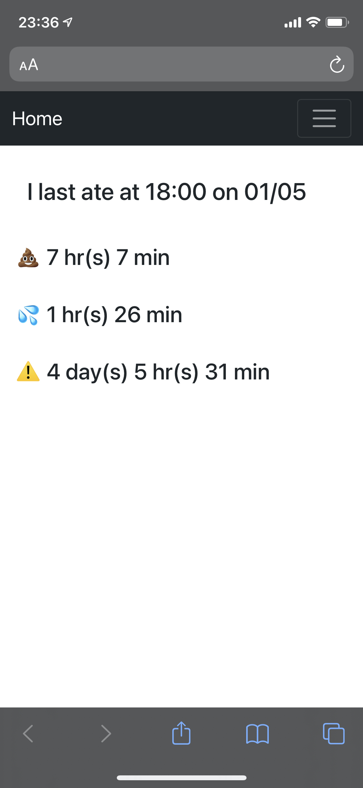

# Puppy Activity Logger

Logs your puppy's activities into a sqlite table so you can know when the last time your puppy did an activity. Currently supports the following activities:

* Potty
* Accidents
* Feeding

iOS Shortcuts routine to log data:
[Shortcut](https://www.icloud.com/shortcuts/c03a8634277c4bb5ad9843439cfada34)

Screen shot on mobile:
